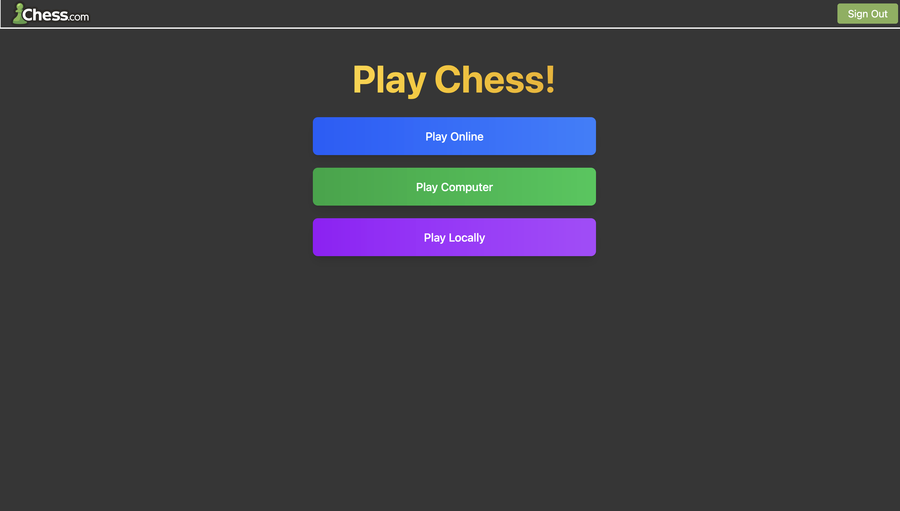
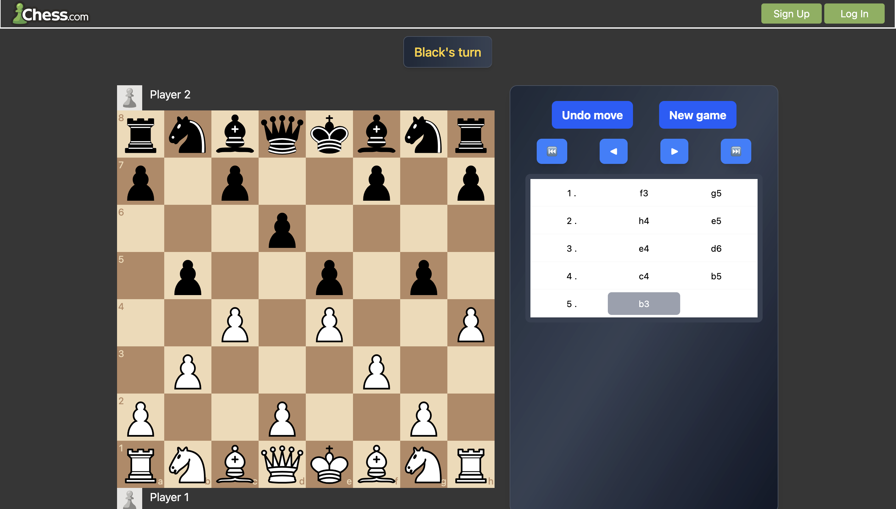
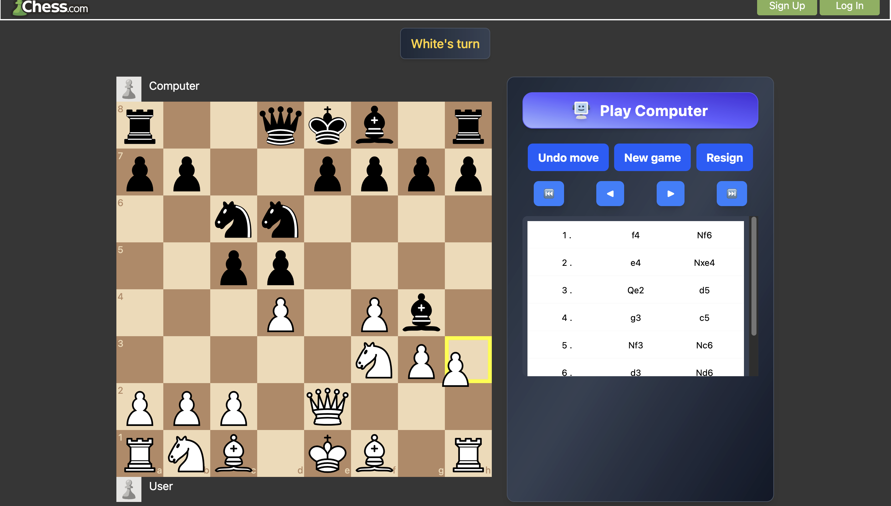
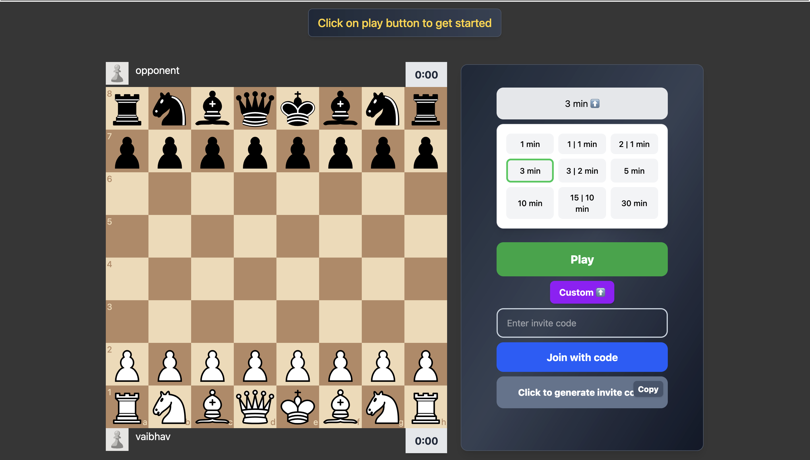
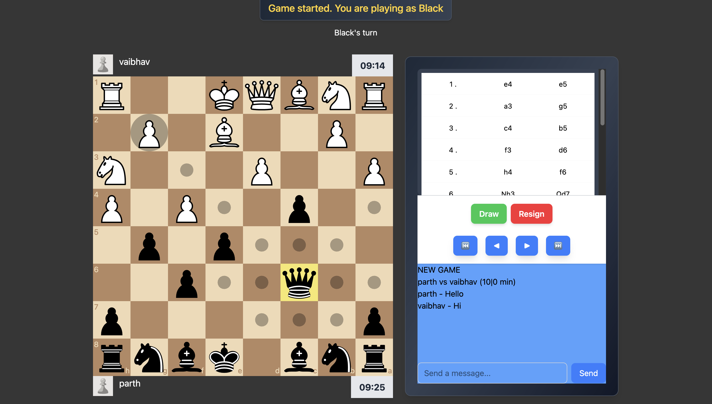

# ♟️ Chess Game

A full-featured multiplayer and AI-powered Chess game built using the MERN stack with real-time WebSocket communication. This project supports multiple modes including AI vs Human, Local 2-Player, and Online Multiplayer with matchmaking, chat, and timers.


## 🎮 Game Modes

1. **Play vs Computer (Stockfish)**

   * Features: Undo, Resign

2. **Play Local (Two players on one device)**

   * Feature: Undo

3. **Play Multiplayer**

   * Random or Invite Code-based matchmaking
   * Real-time Chat
   * Offer/Accept/Reject Draw
   * Timer Mode (1, 3, 5, 10, 30 minutes)
   * Invite Code Generation and Entry
   * Requires Login (or Guest access)

* Common features in all three- Move history, Move history navigation


## ✨ Features

* Login and Signup with Play as Guest options
* Chessboard with drag-and-drop and click-to-move
* Real-time multiplayer via WebSockets
* Mobile-friendly responsive UI
* Sound effects
* Complete input validation on server side and client side


## ⚙️ Setup Instructions

### 1. Clone the Repository

```bash
git clone https://github.com/vaibhav1565/Chess
cd Chess
```

### 2. Setup Backend

```bash
cd backend
npm ci
```

Create a `.env` file in `backend` with:

```
SECRET_KEY=your_secret_key_here
MONGODB_CONNECTION_STRING=your_mongodb_connection_string_here
```

Start backend:

```bash
npm install -g nodemon
npm run dev
```

### 3. Setup Frontend

```bash
cd ../frontend
npm ci
npm run dev
```

Now open your browser and go to the URL shown in terminal (usually [http://localhost:5173](http://localhost:5173)) to use the app.


## Screenshots







## ✨ Contributing
Pull requests are welcome!